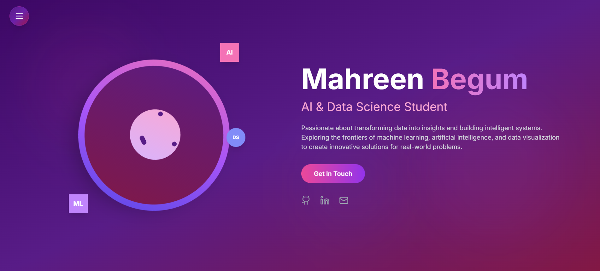

# Mahreen Begum

### Data Analyst | Data Science & Machine Learning Specialist | AI-Driven Solutions

I build systems that turn raw data into decisions — from production-grade machine learning pipelines to agentic AI applications that let people query data in natural language. My work spans the full lifecycle: data cleaning and analysis, statistical modeling, predictive systems, model explainability, and deployment of interactive tools that non-technical users can actually use.

[GitHub](https://github.com/Mahreen17) · [Portfolio](https://my-portfolio-mahreenbegum17.vercel.app/)

---

## Landing Page

The homepage introduces Mahreen Begum as an AI and Data Science student, with a contact call-to-action and links to GitHub, LinkedIn, and email.

---

## Featured Projects

### InsightFlow Data Copilot

An AI-powered data assistant that lets users query structured datasets in plain English and receive accurate, grounded answers — no SQL required.

**Tech stack:** `Google Gemini` `LangChain` `SQL Agents` `RAG` `MCP` `SQLite` `Streamlit`

**Why it matters:** Demonstrates a full agentic AI architecture — an LLM reasoning layer paired with retrieval-augmented grounding and tool-calling agents that execute real SQL against a live database. This is the kind of system that makes internal data genuinely self-serve.

---

### ChurnGuard

An interactive ML dashboard that predicts telecom customer churn, explains why each customer is at risk, and quantifies the financial impact of retention decisions.

**Tech stack:** `Python` `Scikit-learn` `Random Forest` `SHAP` `Pandas` `Streamlit`

**Why it matters:** Goes beyond a black-box prediction. SHAP-based explainability makes model output interpretable to business stakeholders, batch CSV scoring supports real operational workflows, and the built-in ROI calculator ties predictions directly to revenue impact, closing the loop between data science and business decision-making.

---

### FitHub

A web-based AI fitness assistant that uses real-time computer vision to track exercise repetitions and evaluate posture as the user moves.

**Tech stack:** `Python` `OpenCV` `MediaPipe` `Flask`

**Why it matters:** Applies pose estimation and computer vision to a live video stream in real time — a harder engineering problem than static image classification, requiring low-latency inference and robust landmark tracking under variable conditions.

---

## Technical Skills

**Core Languages**

**ML / AI Frameworks**

**Data Tools**

**Deployment Platforms**

**Agents & Orchestration**

---

## Connect

- **GitHub:** [github.com/Mahreen17](https://github.com/Mahreen17)
- **Portfolio:** [my-portfolio-mahreenbegum17.vercel.app](https://my-portfolio-mahreenbegum17.vercel.app/)

Open to data science, machine learning, and AI engineering roles and collaborations. Reach out through the portfolio site or GitHub.
